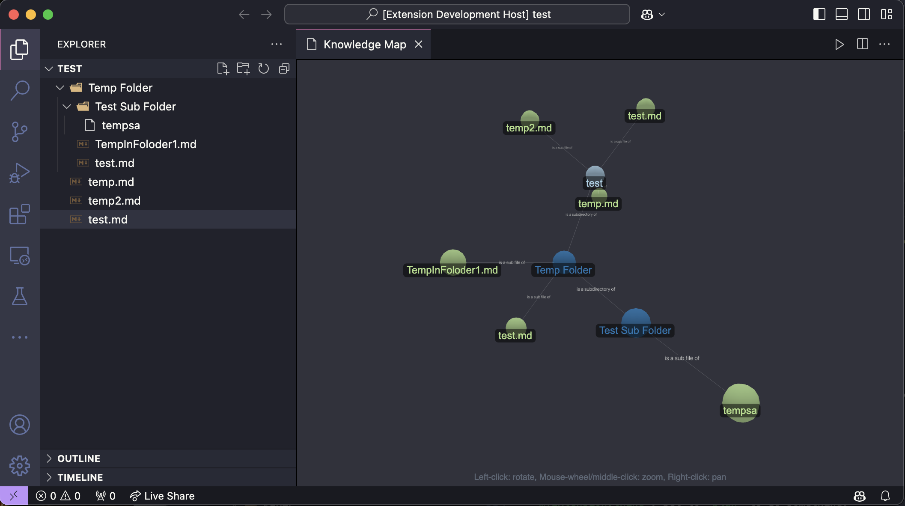

# Visual Studio Code Knowledge Map

Knowledge and relationship tooling for Visual Studio which tracks relationships between concepts, files, and information within the folder that is open including sub folders.

## Features

**Map View:**
Shows a graph of all the files in a workspace and their relationships relative to the folder structure.

## Requirements

This extension leverages the [3D Force Directed Graph](https://vasturiano.github.io/3d-force-graph/) javascript library. Thanks to [Vasco Asturiano](https://observablehq.com/@vasturiano) who created this library.
